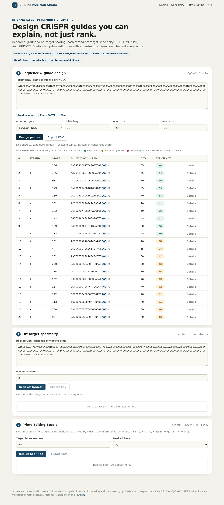

<div align="center">

# 🧬 CRISPR Precision Studio

**Design, rank, explain, and validate CRISPR guides — in one lightweight platform.**

Transparent guide *prioritization*: interpretable on-target scoring, both-strand off-target analysis, and prime-editing support — without GPUs, cloud dependencies, or black-box predictions.

[](https://github.com/Dinesh431786/Crispr/actions/workflows/ci.yml)


-blue)


<sub>CI runs the test suite and renders a live UI screenshot (downloadable as a build artifact) on every push.</sub>

</div>

---

## 📸 The interface



<sub>Rendered automatically by CI on every push — one **Score** per guide, with a per-feature **Details** breakdown.</sub>

---

## ✨ Highlights

| | Feature | What it means |
|---|---|---|
| 🎯 | **One Score** | A single 0–100 prioritization number ranks each guide — no column soup. |
| 🔍 | **Explainable** | `POST /api/explain` shows the per-feature breakdown behind every score. |
| 🧬 | **Both-strand off-targets** | Vectorised NumPy scan + per-site **CFD** & **MIT/Hsu** + aggregate specificity. |
| 🌟 | **Prime Editing Studio** | PRIDICT2.0-informed pegRNA design (Spacer + RTT + PBS). |
| 📚 | **Peer-reviewed scoring** | **CRISPRscan** weights reproduced verbatim & unit-validated — zero downloads. |
| 🔌 | **Pluggable models** | `onnx → trained-linear → heuristic`, auto-selected and reported. |
| ⚡ | **Lightweight** | No GPU, no LLM keys, no DB — everything computed per request. |

---

## 🚀 Quickstart

```bash
cd crispr_app
pip install -r requirements.txt
uvicorn main:app --reload
```

➡️  Open **http://127.0.0.1:8000**

---

## 🎯 The score (production)

Each guide gets **one Score, 0–100** (higher = better) — a *relative prioritization* score combining the on-target predictors, **not** a literal % editing rate. Color-coded:

| 🟢 High | 🟡 Moderate | 🔴 Low |
|:---:|:---:|:---:|
| ≥ 60 | 40 – 59 | < 40 |

Click **Details** on any guide to see *why* it scored that way (GC, Tm, position-specific features…). Component sub-scores stay in the API/CSV for power users — never on screen.

---

## 📊 Accuracy — measured, not asserted

Held-out Spearman ρ on real public datasets (full table + method in **[BENCHMARKS.md](BENCHMARKS.md)**). The platform offers two tiers — a transparent **built-in** ranker (default) and an optional **external deep-learning** backend for maximum raw accuracy:

**🪶 Built-in — lightweight, interpretable, zero setup**

| Model | ρ | Notes |
|---|:---:|---|
| Shipped trained (default) | 0.22 – 0.41 | pooled human SpCas9, leave-one-dataset-out |
| Trained on your own data | 0.40 – 0.52 | one command — `train.py` |
| Heuristic (always available) | ~0.25 | fully interpretable fallback |
| CRISPRscan (peer-reviewed, validated) | 0.58 | on its home dataset |

**🧠 Optional — external deep-learning backend**

| Model | ρ | Notes |
|---|:---:|---|
| ONNX (DeepSpCas9 / CRISPRon) | ~0.85 | bring your own export; auto-detected |

The built-in tier optimises for **transparency and speed** — its job is to *rank* candidates well enough to prioritise, with every score explainable. For maximum raw correlation, drop in a deep model via ONNX.

> ⚠️ **Honesty note.** No predictor can exceed the ~0.71–0.77 reproducibility ceiling of the wet-lab data itself; published state-of-the-art tops out around ~0.85–0.88. Our scores are deterministic surrogates for *ranking*; **wet-lab validation remains essential.**

### Train a stronger model (NumPy-only, no heavy ML stack)

```bash
cd crispr_app
python train.py dataset.csv          # columns: guide,measured[,ngg_context]
# → writes models/linear.json; the API auto-loads it and reports model="linear"

python benchmark.py data.context.tab # measure Spearman on a CRISPOR-format set
```

Position-specific dinucleotide features roughly **double** Spearman on datasets with signal (chari2015 0.20→0.40, morenoMateos 0.17→0.43); gradient boosting matched ridge to ±0.02, so we stay dependency-free.

---

## 🆚 How it compares

Honest positioning — including where we're **weaker**. CRISPOR/CHOPCHOP are mature, genome-aware tools; our edge is *transparent prioritization* in a lightweight, API-first package.

| Capability | CRISPR Precision Studio | CRISPOR | CHOPCHOP | Benchling |
|---|:---:|:---:|:---:|:---:|
| Single explainable prioritization score | ✓ | partial¹ | partial¹ | ✗ |
| Per-feature score breakdown (API) | ✓ | ✗ | ✗ | ✗ |
| Both-strand off-target (CFD + MIT) | ✓ | ✓ (reference) | ✓ | ✓ |
| **Genome-wide** off-target search | ✗ (background seq only) | ✓ | ✓ | ✓ |
| Prime-editing pegRNA design | ✓ | ✗² | partial | ✗ |
| JSON API-first | ✓ | partial | ✗ | ✓ |
| Runs locally, no GPU / no keys | ✓ | ✓³ | ✓³ | ✗ (SaaS) |

<sub>¹ Report several separate scores rather than one explained number. ² CRISPOR targets Cas9/Cas12a guide design; pegRNA design is usually a separate tool (PrimeDesign / pegFinder). ³ Open-source but heavier to self-host. Marks reflect typical usage and may change as those tools evolve.</sub>

**Honest gap:** genome-wide off-target scanning is the main capability CRISPOR/CHOPCHOP have that we don't — it's on the roadmap.

---

## 🏗️ Architecture

```
Browser (templates/index.html + static/app.js)
        │  JSON over fetch()
        ▼
FastAPI (main.py)  ──►  Pydantic validation + utils.validate_sequence
        │
        ▼
Science layer
   ├── scoring.py     on-target efficiency   (Doench RS2 / Azimuth-informed)
   ├── crisprscan.py  CRISPRscan             (Moreno-Mateos 2015, verbatim)
   ├── offtarget.py   CFD + MIT/Hsu + aggregate specificity
   ├── prime.py       pegRNA design          (PRIDICT2.0-informed)
   ├── features.py / models.py / train.py    pluggable + trainable models
   └── analysis.py    pipeline + vectorised both-strand off-target search
        │  pandas DataFrame → JSON
        ▼
Browser renders one ranked table
```

---

## 🔌 API reference

| Method & route | Purpose |
|---|---|
| `GET /health` | liveness check |
| `POST /api/design` | ranked gRNAs with the `ConsensusScore` (the 0–100 Score) |
| `POST /api/offtargets` | per-site CFD/MIT hits + per-guide specificity summary |
| `POST /api/simulate` | protein / indel outcome of an edit |
| `POST /api/prime-design` | ranked pegRNAs (Spacer + RTT + PBS) |
| `POST /api/explain` | interpretable per-feature score breakdown |
| `POST /api/upload-fasta` | parse pasted FASTA / plain DNA |
| `GET /api/models` | active & available on-target backends |

---

## 🌟 Prime editing — how pegRNAs are chosen

For a target base substitution, `prime.py` enumerates and ranks candidate pegRNAs using determinants from PRIDICT2.0 (Mathis 2024) and Anzalone 2019:

1. **Spacer / nick.** Scan NGG PAMs within ~30 nt of the target; place the Cas9 nick 3 bp 5′ of each PAM. Require the edit to fall 0–15 nt downstream of the nick.
2. **PBS (primer-binding site).** Enumerate lengths 8–17 nt; the PBS is the reverse complement of the sequence immediately 5′ of the nick. Its nearest-neighbour **T<sub>m</sub> is optimised toward ~37 °C** (Gaussian reward), with mild length penalties favouring ~13 nt.
3. **RTT (reverse-transcriptase template).** Enumerate lengths 10–20 nt; the RTT encodes the edit and must retain **≥3 nt of 3′ homology past the edit** for flap resolution. Penalties: RTT that **begins with C** (destabilises the edited flap) and RTT GC far from ~55%. Length term favours ~12 nt.
4. **Ranking.** A calibrated logistic score blends the PBS T<sub>m</sub>, PBS/RTT length terms, 3′-homology constraint, RTT-starts-with-C penalty, and GC term into one 0–1 `Score`.

> The pegRNA score is PRIDICT2.0-*informed*, not the trained PRIDICT2.0 network. It reproduces the published determinants for ranking; it has not yet been numerically benchmarked against a PRIDICT test set (on the roadmap). No secondary-structure (e.g. RNAfold) penalty is applied yet.

---

## 🔬 Scientific basis

| Component | Model / source |
|---|---|
| On-target | Doench 2014/2016 *Rule Set 2*/Azimuth (Nat. Biotechnol. 34:184); CRISPRscan (Moreno-Mateos, Nat. Methods 2015) |
| Off-target (site) | **CFD** (Doench 2016) · **MIT/Hsu** (Hsu 2013, Nat. Biotechnol. 31:827) |
| Off-target (guide) | aggregate specificity `10000 / (100 + Σ scores)` (CRISPOR convention) |
| Prime editing | **PRIDICT2.0** (Mathis 2024, doi:10.1038/s41587-024-02268-2); Anzalone 2019 (Nature 576:149) |

---

## ✅ Tests

```bash
pip install pytest
python -m pytest tests/ -q     # 35 passing
```

Covers on-target scoring, CFD/MIT scoring, aggregate specificity, both-strand
off-target detection, pegRNA design, the model registry & trainer, CRISPRscan
reference-vector validation, performance, and dependency hygiene.

---

<div align="center">

**MIT licensed** · No API keys required · Wet-lab validation always essential

</div>
